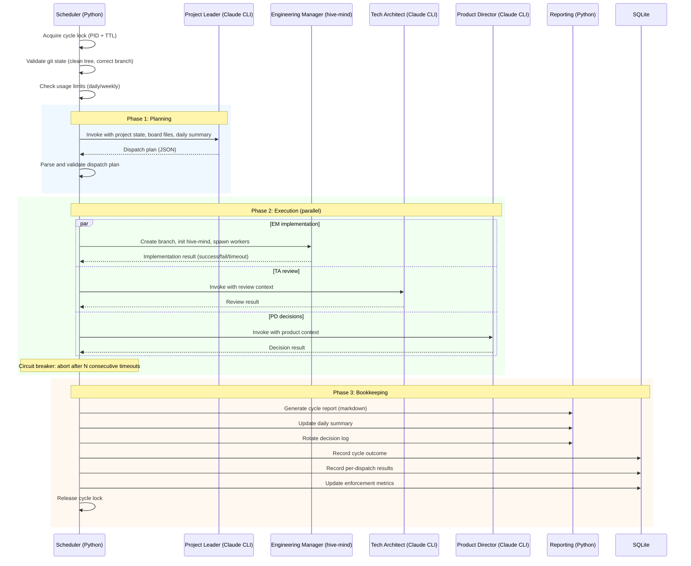
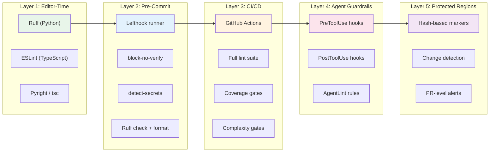

# RFC: Autopilot CLI -- General-Purpose Autonomous Development Orchestrator

**Status**: Draft
**Date**: 2026-03-06
**Authors**: Arendt (Technical Architect Agent)
**Reviewers**: Pending
**Source Documents**: PRD v1.0, Technical Discovery (Norwood), UX Design (Ive), Anti-Pattern Field Guide, Anti-Pattern Enforcement Stack

---

## 1. Context and Scope

The RepEngine autopilot is a battle-tested Python daemon (954 lines, rewritten from bash) that orchestrates autonomous AI agent teams across long-running development sessions. It has survived hundreds of cycles, coordinated four agent roles across concurrent project checkouts, and shipped real PRs. But it is welded to RepEngine. Every new project that wants autonomous development must fork the autopilot directory, rewrite agent prompts, adapt config, and hope nothing breaks.

This RFC proposes **Autopilot CLI**, a standalone Python package that extracts the proven orchestration patterns from RepEngine into a general-purpose tool. The tool lets technical architects define high-level vision, break work into tasks, and have coordinated AI agent teams implement features autonomously. It adds an interactive REPL, layered anti-pattern enforcement across 11 categories, sprint-based task management with velocity tracking, and multi-project orchestration with per-project daemons.

### What This Document Covers

- Architecture and module decomposition for the standalone package
- Key technical decisions with alternatives considered and trade-off rationale
- Anti-pattern enforcement engine design (11 categories, 5 layers)
- Data model, API interfaces, and configuration schema
- Migration path from the existing RepEngine autopilot
- Phased implementation plan with dependencies and exit criteria
- Risk analysis and open questions

### What This Document Does Not Cover

- IDE integration (out of scope for v1)
- Cloud hosting or SaaS components (all execution is local)
- Multi-provider AI support (Claude-only for v1)
- Team collaboration features (single-user for v1)

---

## 2. Goals and Non-Goals

### Goals

1. **Generalize the RepEngine autopilot** into a project-agnostic tool installable via `uv tool install autopilot-cli`.
2. **Provide a project initialization story** where `autopilot init` in any repo produces a working `.autopilot/` directory with config, agent prompts, and enforcement setup in under 2 minutes.
3. **Add an interactive REPL** with context-sensitive prompt, slash commands, tab completion, and Rich-formatted output as the primary interface.
4. **Integrate anti-pattern enforcement** across 5 layers (editor-time, pre-commit, CI/CD, agent guardrails, protected regions) covering 11 documented AI agent anti-pattern categories.
5. **Support sprint-based task management** with Fibonacci estimation, velocity tracking, and capacity forecasting.
6. **Enable multi-project orchestration** with per-project daemons, global resource limits, and unified reporting.
7. **Preserve all battle-tested patterns** from the RepEngine codebase: circuit breaker, model fallback, empty output detection, stale lock recovery, exponential backoff.

### Non-Goals

- **Abstract over multiple AI providers.** The orchestration layer assumes Claude CLI and claude-flow. Multi-provider support adds complexity without current demand.
- **Replace claude-flow or hive-mind.** Autopilot CLI orchestrates these tools; it does not reimplement them.
- **Provide a web UI.** The tool is CLI/REPL-first. A `--web` flag for reports is P2.
- **Support real-time inter-agent communication via MCP.** Document-mediated coordination is the chosen pattern (see Section 5.5).

---

## 3. Technical Design

### 3.1 Architecture Overview

```mermaid
graph TB
    subgraph "User Interface"
        CLI["Typer CLI<br/>(one-shot commands)"]
        REPL["prompt-toolkit REPL<br/>(interactive session)"]
    end

    subgraph "Command Layer (cli/)"
        APP["app.py<br/>Top-level router"]
        PROJ["project.py"]
        TASK["task.py"]
        SESS["session.py"]
        PLAN["plan.py"]
        ENF["enforce.py"]
        RPT["report.py"]
        DISP_CMD["display.py<br/>Rich formatting"]
    end

    subgraph "Domain Layer (core/)"
        CFG["config.py<br/>Pydantic models"]
        MDL["models.py<br/>Data models"]
        PRJ["project.py<br/>Project lifecycle"]
        TSK["task.py<br/>Task management"]
        REG["agent_registry.py<br/>Dynamic agent loading"]
        TPL["templates.py<br/>Jinja2 scaffolding"]
    end

    subgraph "Orchestration Layer (orchestration/)"
        SCHED["scheduler.py<br/>Cycle orchestration"]
        DAEMON["daemon.py<br/>Signal handling, PID"]
        DISPATCH["dispatcher.py<br/>Dispatch plan parsing"]
        INVOKE["agent_invoker.py<br/>Claude CLI subprocess"]
        HIVE["hive.py<br/>claude-flow integration"]
        CB["circuit_breaker.py"]
        USAGE["usage.py<br/>Rate limiting"]
    end

    subgraph "Enforcement Layer (enforcement/)"
        ENG["engine.py<br/>Orchestrator"]
        L1["editor_config.py<br/>Layer 1: Ruff/ESLint"]
        L2["precommit.py<br/>Layer 2: Lefthook"]
        L3["ci.py<br/>Layer 3: GitHub Actions"]
        L4["guardrails.py<br/>Layer 4: PreToolUse"]
        L5["protected.py<br/>Layer 5: Hash regions"]
        QG["quality_gates.py"]
        RULES["rules/<br/>Per-category checks"]
    end

    subgraph "Coordination Layer (coordination/)"
        BOARD["board.py<br/>Project board"]
        QUEST["questions.py<br/>Question queue"]
        DECIDE["decisions.py<br/>Decision log"]
        ANNOUNCE["announcements.py"]
    end

    subgraph "Reporting Layer (reporting/)"
        CYCLE["cycle_reports.py"]
        DAILY["daily_summary.py"]
        VEL["velocity.py"]
        QUAL["quality.py"]
    end

    subgraph "Storage"
        FLAT["Flat Files<br/>(Markdown, YAML)<br/>.autopilot/"]
        DB["SQLite<br/>(WAL mode)<br/>~/.autopilot/autopilot.db"]
    end

    subgraph "External Processes"
        CLAUDE["Claude CLI<br/>(subprocess)"]
        CF["claude-flow<br/>(npx subprocess)"]
        GIT["git<br/>(subprocess)"]
    end

    CLI --> APP
    REPL --> APP
    APP --> PROJ & TASK & SESS & PLAN & ENF & RPT
    PROJ & TASK & SESS --> CFG & MDL & PRJ & TSK
    PLAN --> REG & TPL
    SESS --> SCHED
    SCHED --> DAEMON & DISPATCH & INVOKE & HIVE & CB & USAGE
    ENF --> ENG
    ENG --> L1 & L2 & L3 & L4 & L5 & QG & RULES
    RPT --> CYCLE & DAILY & VEL & QUAL

    INVOKE --> CLAUDE
    HIVE --> CF
    SCHED --> GIT

    SCHED --> BOARD & QUEST & DECIDE
    INVOKE --> FLAT
    ENG --> FLAT
    SCHED --> DB
    VEL --> DB
    ENG --> DB
```



### 3.2 Package Structure

```
autopilot-cli/
  pyproject.toml
  src/autopilot/
    __init__.py
    __main__.py                  # Entry point: `python -m autopilot`
    cli/
      __init__.py
      app.py                     # Typer app, top-level command groups
      project.py                 # project list|show|switch|config|archive
      task.py                    # task create|list|sprint plan|sprint close
      session.py                 # session start|pause|resume|stop|status|log
      plan.py                    # plan discover|tasks|estimate|enqueue
      enforce.py                 # enforce setup|check|report
      report.py                  # report summary|velocity|quality|decisions
      repl.py                    # prompt-toolkit REPL loop
      display.py                 # Rich formatting helpers
    core/
      __init__.py
      config.py                  # Pydantic config models (evolved from RepEngine)
      models.py                  # Dispatch, DispatchPlan, AgentResult, Session, etc.
      project.py                 # Project lifecycle (init, registry, migration)
      task.py                    # Task parsing, creation, sprint planning
      agent_registry.py          # Dynamic agent role discovery from .autopilot/agents/
      templates.py               # Jinja2 template rendering for scaffolding
    orchestration/
      __init__.py
      scheduler.py               # Cycle orchestration (evolved from RepEngine)
      daemon.py                  # Signal handling, PID file, interruptible sleep
      dispatcher.py              # JSON dispatch plan extraction and validation
      agent_invoker.py           # Claude CLI subprocess with retry and env sanitization
      hive.py                    # claude-flow hive-mind lifecycle management
      circuit_breaker.py         # Abort after N consecutive timeouts
      usage.py                   # Daily/weekly cycle count tracking
    enforcement/
      __init__.py
      engine.py                  # EnforcementEngine orchestrator
      editor_config.py           # Layer 1: Generate ruff/eslint/pyright configs
      precommit.py               # Layer 2: Lefthook setup, block-no-verify
      ci.py                      # Layer 3: GitHub Actions workflow templates
      guardrails.py              # Layer 4: PreToolUse/PostToolUse hooks
      protected.py               # Layer 5: Hash-based code region protection
      quality_gates.py           # Quality gate prompt generation for hive-mind
      metrics.py                 # Enforcement metric collection to SQLite
      rules/
        __init__.py
        base.py                  # EnforcementRule protocol
        duplication.py           # Category 1: Infrastructure duplication
        conventions.py           # Category 2: Ignored conventions
        overengineering.py       # Category 3: Over-engineering
        security.py              # Category 4: Security vulnerabilities
        error_handling.py        # Category 5: Error handling gaps
        dead_code.py             # Category 6: Dead code
        type_safety.py           # Category 7: Type safety violations
        test_quality.py          # Category 8: Test anti-patterns
        comments.py              # Category 9: Excessive comments
        deprecated.py            # Category 10: Deprecated APIs
        async_misuse.py          # Category 11: Async misuse
    reporting/
      __init__.py
      cycle_reports.py           # Per-cycle markdown reports
      daily_summary.py           # Aggregated daily view for PL context
      velocity.py                # Sprint velocity tracking and forecasting
      quality.py                 # Enforcement trend analysis
      decision_log.py            # Decision audit trail with rotation
    coordination/
      __init__.py
      board.py                   # Project board management
      questions.py               # Question queue (agent -> human)
      announcements.py           # Human -> agent broadcasts
      decisions.py               # Decision log with archival
    utils/
      __init__.py
      subprocess.py              # Clean env builder, Claude CLI helpers
      process.py                 # PID file, daemon detection
      sanitizer.py               # Regex-based secret redaction
      paths.py                   # Project/autopilot path resolution
      git.py                     # Git operations (branch, fetch, status)
      db.py                      # SQLite connection management (WAL mode)
  templates/
    python/                      # Python project scaffolding
      agents/                    # Default agent prompts (PL, EM, TA, PD)
      board/                     # Initial board files
      config.yaml.j2             # Jinja2 config template
      enforcement/               # Default enforcement configs
    typescript/                  # TypeScript project scaffolding
    hybrid/                      # Mixed Python/TypeScript
  tests/                         # Mirror of src/ structure
```

### 3.3 Agent Orchestration Flow

This is the core execution loop, evolved directly from the RepEngine scheduler:



### 3.4 Data Model

#### 3.4.1 Configuration Schema (Pydantic)

The configuration model uses a three-level hierarchy: global defaults (`~/.autopilot/config.yaml`), project overrides (`.autopilot/config.yaml`), and CLI flags.

```python
class ProjectConfig(BaseModel):
    """Per-project configuration."""
    name: str
    type: Literal["python", "typescript", "hybrid"]
    root: Path = Path(".")

class SchedulerConfig(BaseModel):
    strategy: Literal["interval", "event", "hybrid"] = "interval"
    interval_seconds: int = 1800
    cycle_timeout_seconds: int = 7200
    agent_timeout_seconds: int = 900
    agent_timeouts: dict[str, int] = {}       # Per-role overrides
    consecutive_timeout_limit: int = 2

class UsageLimitsConfig(BaseModel):
    daily_cycle_limit: int = 200
    weekly_cycle_limit: int = 1400
    max_agent_invocations_per_cycle: int = 40

class AgentsConfig(BaseModel):
    roles: list[str] = ["project-leader", "engineering-manager",
                         "technical-architect", "product-director"]
    models: dict[str, str] = {}               # Role -> model name
    max_turns: dict[str, int] = {}            # Role -> max turns
    fallback_models: dict[str, list[str]] = {} # Role -> fallback chain
    max_concurrent: int = 3

class QualityGatesConfig(BaseModel):
    pre_commit: str = ""
    type_check: str = ""
    test: str = ""
    all: str = ""

class EnforcementConfig(BaseModel):
    enabled: bool = True
    categories: list[str] = [...]             # All 11 by default

class SafetyConfig(BaseModel):
    auto_merge: bool = True
    require_ci_pass: bool = True
    require_review_approval: bool = True
    max_files_per_commit: int = 100
    require_tests: bool = True

class ApprovalConfig(BaseModel):
    auto_approve_low_risk: bool = True
    auto_approve_medium_risk: bool = False
    require_approval_for_deletions: bool = True
    require_approval_for_schema_changes: bool = True

class ClaudeConfig(BaseModel):
    extra_flags: str = "--dangerously-skip-permissions"
    mcp_config: str = ".mcp.json"
    claude_flow_version: str = "alpha"

class GitConfig(BaseModel):
    base_branch: str = "main"
    branch_prefix: str = "feat/"
    branch_strategy: Literal["batch", "per-task"] = "batch"

class AutopilotConfig(BaseModel):
    """Root configuration model."""
    project: ProjectConfig
    scheduler: SchedulerConfig = SchedulerConfig()
    usage_limits: UsageLimitsConfig = UsageLimitsConfig()
    agents: AgentsConfig = AgentsConfig()
    quality_gates: QualityGatesConfig = QualityGatesConfig()
    enforcement: EnforcementConfig = EnforcementConfig()
    safety: SafetyConfig = SafetyConfig()
    approval: ApprovalConfig = ApprovalConfig()
    claude: ClaudeConfig = ClaudeConfig()
    git: GitConfig = GitConfig()
```

#### 3.4.2 SQLite Schema

Located at `~/.autopilot/autopilot.db`. WAL mode enabled for concurrent access from multiple per-project daemons.

```sql
CREATE TABLE projects (
    id TEXT PRIMARY KEY,
    name TEXT NOT NULL UNIQUE,
    path TEXT NOT NULL,
    type TEXT NOT NULL CHECK (type IN ('python', 'typescript', 'hybrid')),
    created_at TEXT NOT NULL DEFAULT (strftime('%Y-%m-%dT%H:%M:%SZ', 'now')),
    config_hash TEXT
);

CREATE TABLE sessions (
    id TEXT PRIMARY KEY,
    project_id TEXT NOT NULL REFERENCES projects(id),
    type TEXT NOT NULL CHECK (type IN ('daemon', 'cycle', 'discovery', 'manual')),
    status TEXT NOT NULL CHECK (status IN ('running', 'completed', 'failed', 'paused')),
    pid INTEGER,
    started_at TEXT NOT NULL,
    ended_at TEXT,
    agent_name TEXT,
    cycle_id TEXT,
    metadata TEXT                -- JSON blob for session-specific data
);

CREATE TABLE cycles (
    id TEXT PRIMARY KEY,
    project_id TEXT NOT NULL REFERENCES projects(id),
    session_id TEXT REFERENCES sessions(id),
    status TEXT NOT NULL CHECK (status IN ('COMPLETED', 'PARTIAL', 'FAILED')),
    started_at TEXT NOT NULL,
    ended_at TEXT,
    dispatches_planned INTEGER DEFAULT 0,
    dispatches_succeeded INTEGER DEFAULT 0,
    dispatches_failed INTEGER DEFAULT 0,
    duration_seconds REAL
);

CREATE TABLE dispatches (
    id INTEGER PRIMARY KEY AUTOINCREMENT,
    cycle_id TEXT NOT NULL REFERENCES cycles(id),
    agent TEXT NOT NULL,
    action TEXT,
    project_name TEXT,
    task_id TEXT,
    status TEXT NOT NULL CHECK (status IN ('success', 'failed', 'timeout')),
    duration_seconds REAL,
    exit_code INTEGER,
    error TEXT
);

CREATE TABLE enforcement_metrics (
    id INTEGER PRIMARY KEY AUTOINCREMENT,
    project_id TEXT NOT NULL REFERENCES projects(id),
    collected_at TEXT NOT NULL,
    category TEXT NOT NULL,      -- One of the 11 anti-pattern categories
    violation_count INTEGER DEFAULT 0,
    files_scanned INTEGER DEFAULT 0,
    metadata TEXT                -- JSON: specific rule violations
);

CREATE TABLE velocity (
    id INTEGER PRIMARY KEY AUTOINCREMENT,
    project_id TEXT NOT NULL REFERENCES projects(id),
    sprint_id TEXT NOT NULL,
    started_at TEXT,
    ended_at TEXT,
    points_planned INTEGER DEFAULT 0,
    points_completed INTEGER DEFAULT 0,
    tasks_completed INTEGER DEFAULT 0,
    tasks_carried_over INTEGER DEFAULT 0
);

-- Indices for common query patterns
CREATE INDEX idx_sessions_project ON sessions(project_id);
CREATE INDEX idx_cycles_project ON cycles(project_id);
CREATE INDEX idx_dispatches_cycle ON dispatches(cycle_id);
CREATE INDEX idx_dispatches_agent ON dispatches(agent);
CREATE INDEX idx_enforcement_project_date ON enforcement_metrics(project_id, collected_at);
CREATE INDEX idx_velocity_project ON velocity(project_id);
```

#### 3.4.3 Directory Layout Per Project

```
my-project/
  .autopilot/
    config.yaml                  # Project configuration
    agents/                      # Agent prompt files (one .md per role)
      project-leader.md
      engineering-manager.md
      technical-architect.md
      product-director.md
    board/                       # Document-mediated coordination
      project-board.md
      question-queue.md
      decision-log.md
      announcements.md
      cycle-reports/             # Per-cycle markdown reports
        cycle-2026-03-06-001.md
    tasks/                       # Task files (RepEngine format)
      tasks-index.md
      tasks-1.md
    discoveries/                 # Discovery documents
      2026-03-06.md
    state/                       # Runtime state (gitignored)
      daemon.pid
      cycle.lock
      sessions.json
    logs/                        # Session logs (gitignored)
      daemon.log
      cycle-001.log
    enforcement/                 # Custom enforcement rules (optional)
      rules/
        custom_rule.py
```

### 3.5 Anti-Pattern Enforcement Engine

The enforcement engine is the largest net-new component. It operationalizes the research findings that AI coding agents produce 1.7x more defects per PR than human developers, with specific, measurable anti-patterns appearing at rates from 36% to 100% depending on category.

#### 3.5.1 The 11 Categories

| # | Category | AI Prevalence | Severity | Primary Detection |
|---|----------|---------------|----------|-------------------|
| 1 | Infrastructure duplication | 80-90% | Critical | Ruff TID251 banned-api, Semgrep custom rules |
| 2 | Ignored conventions | 90-100% | High | Ruff I/N rules, ESLint naming-convention |
| 3 | Over-engineering | 80-90% | Medium-High | Ruff C901 (complexity), SIM (simplify) |
| 4 | Security vulnerabilities | 36-62% | Critical | Ruff S (bandit), Semgrep p/secrets, detect-secrets |
| 5 | Error handling gaps | ~2x human | High | Ruff BLE/TRY, Pyright reportOptionalMemberAccess |
| 6 | Dead code | High | Medium | Ruff F401/F841/ERA001/ARG |
| 7 | Type safety violations | Common | High | Pyright strict, Ruff ANN401 |
| 8 | Test anti-patterns | 40-70% | High | Ruff PT rules, jest/expect-expect |
| 9 | Excessive comments | 90-100% | Low-Medium | Ruff ERA001, comment density analysis |
| 10 | Deprecated APIs | Common | Medium-High | Ruff TID251/UP, Pyright reportDeprecated |
| 11 | Async misuse | 2x human | Critical | Ruff ASYNC100-102, Pyright |

#### 3.5.2 The 5 Enforcement Layers

Each layer catches problems at a different point in the development pipeline, providing defense in depth:



**Layer 1: Editor-Time Configuration** (< 100ms feedback)

The engine generates tool-specific config additions. For Python projects, this means extending `pyproject.toml` with Ruff rules covering all 11 categories. For TypeScript, extending `.eslintrc` with equivalent rules. This is the cheapest enforcement point -- most issues are flagged before any commit.

**Layer 2: Pre-Commit Hooks** (< 5s total)

Install Lefthook with enforcement rules. Two critical additions beyond standard linting:
- `block-no-verify`: Prevents AI agents from bypassing hooks with `--no-verify`. Research shows agents attempt this on "almost every commit."
- `detect-secrets`: Credential scanning for hardcoded API keys, tokens, and passwords (Category 4).

**Layer 3: CI/CD Pipeline** (backstop)

Generate GitHub Actions workflow templates with quality gate jobs, coverage thresholds, and complexity limits. Nothing merges without passing. This catches anything that slips past local enforcement.

**Layer 4: Real-Time Agent Guardrails** (< 10ms per evaluation)

PreToolUse/PostToolUse hook integration for Claude Code sessions:
- Block dangerous operations (deleting protected files, `--no-verify`, installing unauthorized dependencies)
- Inject warnings during agent execution
- Progressive trust model with circuit breaker (errors -> warnings to prevent agent lockup; security rules exempt)

**Layer 5: Protected Code Regions** (change control)

Hash-based protection markers for critical code (auth logic, payment processing, data migration):

```python
#@protected 3 a1b2c3d4
def validate_oauth_token(token: str) -> bool:
    """Critical auth logic -- hash prevents silent AI modification."""
    return verify_jwt(token, SECRET_KEY)
```

Changes to protected regions require explicit hash updates, making them visible in diffs and impossible for AI to silently modify.

#### 3.5.3 Integration with the Autonomous Pipeline

The enforcement engine is not a separate tool. It is embedded in the autonomous pipeline at five integration points:

1. **At init:** `autopilot init` configures all 5 layers for the detected project type using Jinja2 templates.
2. **At planning:** Discovery documents include an enforcement baseline analysis (current violation counts per category).
3. **At execution:** Quality gates are injected into every hive-mind objective via dynamic prompt generation:

```python
def build_quality_gate_prompt(self) -> str:
    """Build quality gate instructions for agent prompts."""
    gates = self.project.quality_gates
    lines = [
        "\n\nBefore reporting completion, every worker MUST run the quality gate:",
    ]
    for i, (name, cmd) in enumerate(gates.items(), 1):
        lines.append(f"({i}) {name}: `{cmd}`")
    lines.append(
        "Stage and commit any auto-fix changes. "
        "Do NOT leave unstaged formatting changes."
    )
    return " ".join(lines)
```

4. **At reporting:** Enforcement metrics are collected per cycle and stored in SQLite for trend analysis.
5. **On demand:** `autopilot enforce check` runs the full suite. `autopilot enforce report` shows trends.

#### 3.5.4 Custom Enforcement Rules

Rules follow a Python protocol, allowing project-specific additions without modifying the core tool:

```python
class EnforcementRule(Protocol):
    category: str           # One of the 11 categories
    severity: str           # "error" | "warning" | "info"
    name: str

    def check(self, project_root: Path) -> list[Violation]: ...
    def fix(self, project_root: Path) -> list[Fix]: ...  # Optional auto-fix
```

Custom rules are loaded from `.autopilot/enforcement/rules/` using Python's import machinery.

### 3.6 Inter-Agent Communication Model

Agents communicate through document-mediated coordination: flat markdown files in `.autopilot/board/`. Each agent reads fresh state at the start of every invocation. There are no message queues, no coordination protocols, and no stale caches.

| Channel | Direction | Medium | Purpose |
|---------|-----------|--------|---------|
| Project Board | PL <-> All | `board/project-board.md` | Sprint status, active work, blockers |
| Question Queue | Agent -> Human | `board/question-queue.md` | Decisions requiring human input |
| Decision Log | PL -> All | `board/decision-log.md` | Recorded decisions with rationale |
| Announcements | Human -> All | `board/announcements.md` | Policy changes, priority shifts |
| Daily Summary | Scheduler -> PL | Generated markdown | Cycle history for PL context |
| Dispatch Plan | PL -> Scheduler | JSON (stdout) | Structured agent instructions |

### 3.7 Dynamic Agent Registry

Any `.md` file in `.autopilot/agents/` becomes an available agent role. The PL prompt is dynamically assembled with the current roster. Custom roles (security-reviewer, performance-tester, documentation-writer) require no code changes.

```python
class AgentRegistry:
    def __init__(self, autopilot_dir: Path):
        self.agents_dir = autopilot_dir / "agents"

    def list_agents(self) -> list[str]:
        """Return all available agent names from .md files."""
        return [
            f.stem for f in self.agents_dir.glob("*.md")
            if not f.name.startswith("_")
        ]

    def load_prompt(self, name: str) -> str:
        """Load the system prompt for an agent role."""
        path = self.agents_dir / f"{name}.md"
        if not path.exists():
            raise AgentNotFoundError(name, available=self.list_agents())
        return path.read_text()

    def validate_dispatch(self, plan: DispatchPlan) -> list[str]:
        """Validate all agents in a dispatch plan exist."""
        available = set(self.list_agents())
        return [d.agent for d in plan.dispatches if d.agent not in available]
```

### 3.8 Error Recovery

All battle-tested patterns from RepEngine are preserved and extended:

| Pattern | Trigger | Behavior | Source |
|---------|---------|----------|--------|
| Exponential backoff | Transient API errors | 2 retries, 45s/90s backoff | RepEngine (preserved) |
| Circuit breaker | N consecutive timeouts | Abort remaining dispatches in cycle | RepEngine (preserved) |
| Model fallback | Primary model failure | opus 4.6 -> opus 4.5 -> sonnet | RepEngine (preserved) |
| Empty output detection | Claude CLI exit 0 with no output in < 8s | Treat as failure, retry | RepEngine (preserved) |
| Stale lock recovery | Cycle lock PID not alive or TTL exceeded | Force-recover lock | RepEngine (preserved) |
| Session recovery | Daemon restart with orphaned processes | Detect and clean up orphaned Claude processes | New |
| Partial dispatch recovery | Mid-cycle failure | Resume from last successful dispatch | New |
| Git state recovery | Dirty tree or wrong branch | Validate before each cycle, stash/abort | New |

---

## 4. Alternatives Considered

### 4.1 Python vs TypeScript

**Decision:** Python 3.12+

**Alternatives considered:**
- **(a) TypeScript/Node.js** -- Would align with claude-flow's runtime. However, the existing RepEngine autopilot is 954 lines of typed, tested, production Python. The runtime manages subprocesses, PID files, and POSIX signals. Python's `subprocess`, `os`, and `signal` modules handle all of this natively. Rewriting in TypeScript would throw away battle-tested code for zero functional benefit. Node.js subprocess management and signal handling are weaker than Python's for daemon-style processes.
- **(b) Go** -- Better for CLI distribution (single binary). However, the tool heavily manipulates YAML, Markdown, and Jinja2 templates. Python's ecosystem for these is unmatched. Go would also prevent reusing any RepEngine code.

**Trade-off:** Python requires a runtime (mitigated by `uv tool install` providing isolated environments). The team has deep Python expertise and the existing codebase is Python.

### 4.2 Typer + Rich + prompt-toolkit vs Alternatives

**Decision:** Typer for command routing, Rich for output formatting, prompt-toolkit for REPL.

**Alternatives considered:**
- **(a) Click + Rich** -- Click is more flexible but more verbose. Typer auto-generates help, shell completions, and argument validation from type annotations. For a CLI with 30+ commands, the reduced boilerplate is significant.
- **(b) Textual for TUI** -- Textual is a full TUI framework. It would be ideal for the watch mode but is overkill for the primary REPL interface. Rich Live Display covers the 80% case for the watch mode TUI with far less complexity. Textual remains an option for P2 if Rich Live proves insufficient.
- **(c) IPython/Jupyter for REPL** -- The interaction model is command-oriented (`/session start`), not Python-oriented (`workspace.sessions.start()`). prompt-toolkit provides the readline layer (history, completion, keybindings) without imposing a Python REPL paradigm.

**Trade-off:** Three libraries instead of one monolithic framework. Each does one thing well and they compose cleanly. The total dependency footprint remains small.

### 4.3 `.autopilot/` Directory Convention vs Alternatives

**Decision:** Dot-directory inside the project root.

**Alternatives considered:**
- **(a) Sibling directory** (`autopilot/`) -- The RepEngine pattern. Works, but pollutes the project root namespace and is not distinguishable from application code.
- **(b) External directory** (`~/.autopilot/projects/<name>/`) -- Centralizes all autopilot state. Breaks portability: cloning a repo does not bring autopilot config. Makes git-versioning the config impossible.
- **(c) `pyproject.toml` section** (`[tool.autopilot]`) -- Too limiting for the config depth required (agent prompts, board files, enforcement rules). Also excludes non-Python projects.

**Trade-off:** The dot-directory adds files to the project repo. This is intentional: config, agent prompts, and board files should be version-controlled. Runtime state (`state/`, `logs/`) is gitignored.

### 4.4 Per-Project Daemons vs Single Daemon

**Decision:** Per-project daemons with global resource limits.

**Alternatives considered:**
- **(a) Single orchestrator** (RepEngine model) -- One daemon reads all projects, PL decides allocation. Simpler to implement. However, a stuck cycle in project A blocks project B. The PL prompt becomes unwieldy when juggling multiple projects. Failure isolation is poor.
- **(b) Per-project daemons, no coordination** -- Each project is fully independent. Simple, but allows resource exhaustion (5 daemons each spawning 5 agents overwhelms the machine and Claude Max limits).
- **(c) Per-project daemons with global resource broker** -- (chosen) Each project runs its own daemon. A lightweight global config (`max_concurrent_daemons`, `max_concurrent_agents`) caps total resource usage. No runtime cross-project intelligence in v1; daemons check global limits at startup and before each cycle.

**Trade-off:** No cross-project intelligence (e.g., reallocating idle project A's cycles to busy project B). This can be added as a global scheduler layer in v2 without changing the per-project daemon architecture.

### 4.5 Hybrid Flat Files + SQLite vs Alternatives

**Decision:** Flat files for human-readable coordination, SQLite for analytics.

**Alternatives considered:**
- **(a) All flat files** (RepEngine model) -- Works for single-project. Breaks down for queries like "show me the EM agent timeout rate across all projects over the last 30 days." After 1,000 cycles with 4 dispatches each, the flat-file approach produces 4,000 JSON files or one unwieldy mega-file.
- **(b) All SQLite** -- Agents cannot read SQLite directly. Board files, agent prompts, and task files must remain human-readable markdown for agents to consume and for humans to review in their editor.
- **(c) PostgreSQL** -- Overkill for a local CLI tool. Adds an infrastructure dependency. SQLite handles the scale (thousands of rows, not millions) with zero operational overhead.

**Trade-off:** Two storage systems to maintain. The boundary is clean: if an agent reads or writes it, it is a flat file. If the tool queries or aggregates it, it is SQLite.

### 4.6 Dynamic Agent Registry vs Hardcoded Roles

**Decision:** Dynamic registry based on `.autopilot/agents/*.md` files.

**Alternatives considered:**
- **(a) Hardcoded roles** (RepEngine model) -- `VALID_AGENTS = frozenset({"project_leader", "engineering_manager", ...})`. Simple but inflexible. Adding a security-reviewer or documentation-writer requires code changes.
- **(b) Plugin system with Python classes** -- Each agent role is a Python class with dispatch logic. Powerful but heavy. The dispatch logic is the same for all agents (invoke Claude CLI with a prompt). Only the prompt differs.

**Trade-off:** The dynamic registry means any markdown file becomes an agent. There is no validation that the prompt is well-formed or will produce useful output. Mitigation: provide `autopilot agent test <role>` for dry-run dispatch evaluation, and ship battle-tested templates.

### 4.7 Document-Mediated Coordination vs MCP-Based Inter-Agent Communication

**Decision:** Document-mediated via flat files.

**Alternatives considered:**
- **(a) MCP-based real-time communication** -- Agents communicate through MCP tool calls. Enables real-time coordination (agent A asks agent B a question mid-task). However, MCP tools are available inside Claude sessions, not from standalone Python processes. The autopilot daemon would need to run as an MCP client or wrap itself in a Claude session. This adds significant complexity for a use case that does not exist yet: the cycle-based workflow is inherently asynchronous.
- **(b) Message queue (Redis, ZMQ)** -- Agents publish/subscribe to topics. Enables event-driven coordination. Adds infrastructure dependencies and operational complexity. The cycle-based workflow does not need real-time messaging.
- **(c) Shared in-memory state** -- Only works within a single process. Agents are separate Claude CLI subprocesses.

**Trade-off:** Document-mediated coordination is simple and debuggable (every state is a file you can read). The cost is latency: agents only see state changes at the start of their next invocation. For the cycle-based workflow where agents run sequentially or in parallel batches, this latency is acceptable.

### 4.8 Configurable Quality Gates vs Hardcoded Enforcement

**Decision:** Per-project-type quality gate definitions in YAML config.

**Alternatives considered:**
- **(a) Hardcoded quality gates** (RepEngine model) -- The current `_QUALITY_GATE_SUFFIX` is a string constant appended to hive-mind objectives. Works for one project. Breaks when projects use different toolchains (uv vs pnpm, pytest vs vitest, ruff vs eslint).
- **(b) Auto-detected quality gates** -- Detect the project's toolchain and infer appropriate gates. Fragile: too many edge cases (monorepos with mixed tools, custom test runners, project-specific lint configs).

**Trade-off:** Config-driven quality gates require the user to specify commands during `autopilot init`. The init wizard pre-fills based on detected stack. Expert users can customize freely.

---

## 5. Migration Path from RepEngine Autopilot

### 5.1 Code Evolution Strategy

The Autopilot CLI is not a rewrite from scratch. It is an evolution of the RepEngine autopilot, module by module:

| RepEngine Module | Lines | Autopilot CLI Module | Changes |
|-----------------|-------|---------------------|---------|
| `scheduler.py` | 691 | `orchestration/scheduler.py` | Extract hardcoded paths, add configurable quality gates, add session tracking |
| `agent.py` | 292 | `orchestration/agent_invoker.py` | Generalize agent prompt loading, add dynamic registry |
| `hive.py` | 353 | `orchestration/hive.py` | Version-pin claude-flow, configurable branch naming |
| `daemon.py` | 167 | `orchestration/daemon.py` | Per-project PID/log isolation |
| `dispatch.py` | 133 | `orchestration/dispatcher.py` | Validate against dynamic agent registry |
| `config.py` | 158 | `core/config.py` | Expand for all new features, preserve backward compat |
| `models.py` | 108 | `core/models.py` | Add Session, EnforcementMetric, Velocity models |
| `reports.py` | 250 | `reporting/` | Split into cycle, daily, velocity, quality, decisions |
| `usage.py` | 114 | `orchestration/usage.py` | Add per-project limits, SQLite backing |
| `sanitizer.py` | 32 | `utils/sanitizer.py` | Direct port |
| `cli.py` | 367 | `cli/` | Rewrite for Typer, split into command groups |
| `cli_display.py` | 285 | `cli/display.py` | Rewrite for Rich, add REPL integration |

### 5.2 `autopilot migrate` Command

For existing RepEngine autopilot installations:

```
autopilot migrate [--project-root PATH]

Steps:
1. Detect RepEngine autopilot layout (autopilot/ sibling directory)
2. Read existing config.yaml, map to new schema
3. Copy agent prompts to .autopilot/agents/
4. Copy board files to .autopilot/board/
5. Convert state files (usage-tracker.json, hive-sessions.json) to SQLite
6. Register project in ~/.autopilot/projects.yaml
7. Generate .gitignore entries for .autopilot/state/ and .autopilot/logs/

Non-destructive: original autopilot/ directory is preserved.
```

---

## 6. Implementation Plan

### Phase 1: Foundation (3-5 sprints, ~40-65 story points)

**Goal:** Working CLI with project init and basic REPL. No autonomous execution.

**Deliverables:**
- Package scaffolding (`pyproject.toml`, src layout, test infrastructure, CI)
- Core config model (evolved from RepEngine `config.py`)
- Core data models (evolved from RepEngine `models.py`)
- `autopilot init` with Python project template (Jinja2)
- `autopilot project list/show/switch/config`
- REPL skeleton with prompt-toolkit (context-sensitive prompt, slash commands, tab completion)
- Rich display helpers (tables, panels, progress indicators)
- SQLite schema and connection management (WAL mode)
- Shared utilities (subprocess, process, sanitizer, paths, git)

**Dependencies:** None (greenfield).

**Exit criteria:** `autopilot init --type python --name test-project` creates a valid `.autopilot/` directory. `autopilot` launches a REPL with context-sensitive prompt. `autopilot project list` shows registered projects.

### Phase 2: Task Management (2-3 sprints, ~25-40 story points)

**Goal:** Full task lifecycle, manual execution only.

**Deliverables:**
- Task file parsing (RepEngine markdown format)
- `task create`, `task list`, `task create --from-discovery`
- Sprint planning with velocity tracking
- `task sprint plan/close`
- Fibonacci estimation support
- SQLite velocity storage

**Dependencies:** Phase 1 (config, models, REPL, SQLite).

**Exit criteria:** Full task create -> estimate -> sprint plan -> track lifecycle. Tasks are valid RepEngine-format markdown.

### Phase 3: Autonomous Execution (3-5 sprints, ~50-80 story points)

**Goal:** The daemon runs cycles, dispatches agents, and produces PRs.

**Deliverables:**
- Agent invoker (evolved from RepEngine `agent.py`)
- Dispatch parser (evolved from RepEngine `dispatch.py`)
- Scheduler with cycle orchestration (evolved from RepEngine `scheduler.py`)
- Daemon with signal handling (evolved from RepEngine `daemon.py`)
- Hive-mind integration (evolved from RepEngine `hive.py`)
- Circuit breaker and usage tracking
- Dynamic agent registry
- Session management (`session start/stop/pause/resume/status/log`)
- Document-mediated coordination (board, questions, decisions)
- Cycle reports, daily summary, decision log with rotation
- Dashboard (80x24 two-column layout with Rich)

**Dependencies:** Phase 2 (task management for dispatch targets).

**Exit criteria:** `autopilot session start` launches a daemon that runs cycles. Dispatches produce real Claude CLI invocations. Cycle reports are written. Dashboard shows live session state.

### Phase 4: Enforcement Engine (2-3 sprints, ~30-45 story points)

**Goal:** All 5 enforcement layers operational.

**Deliverables:**
- Enforcement engine orchestrator (`enforcement/engine.py`)
- Layer 1: Editor config generation (ruff, eslint, pyright)
- Layer 2: Pre-commit hook setup (lefthook, block-no-verify, detect-secrets)
- Layer 3: CI/CD template generation (GitHub Actions)
- Layer 4: Agent guardrail integration (PreToolUse/PostToolUse hooks)
- Layer 5: Protected code region support
- 11-category rule implementations
- `enforce setup/check/report`
- Enforcement metrics collection to SQLite
- Quality gate prompt generation for hive-mind objectives

**Dependencies:** Phase 3 (hive-mind integration for quality gate injection).

**Exit criteria:** `autopilot enforce setup` configures all 5 layers for Python projects. `autopilot enforce check` reports violations by category. Quality gates are injected into hive-mind objectives.

### Phase 5: Discovery and Polish (2-3 sprints, ~25-40 story points)

**Goal:** End-to-end workflow from discovery to autonomous execution.

**Deliverables:**
- Norwood discovery agent prompt template
- `plan discover`, `plan tasks`, `plan estimate`, `plan enqueue`
- Discovery-to-task conversion pipeline
- Shelly estimation agent integration
- TypeScript project template
- `autopilot migrate` (RepEngine layout conversion)
- Shell completions (bash, zsh, fish)
- Documentation

**Dependencies:** Phase 3 (agent invocation for discovery sessions), Phase 4 (enforcement baseline in discovery).

**Exit criteria:** `plan discover` -> discovery doc -> `plan tasks` -> task files -> `session start` -> autonomous execution produces PRs.

### Phase 6: Multi-Project and Advanced (2-3 sprints, ~30-50 story points)

**Goal:** Production-ready multi-project orchestration.

**Deliverables:**
- Global resource broker (`max_concurrent_daemons`, `max_concurrent_agents`)
- Per-project usage limits and priority weights
- Cross-project reporting dashboard
- Watch mode TUI (`/watch` with Rich Live)
- Event-driven scheduler triggers
- Custom template support (`~/.autopilot/templates/`)
- Workflow hooks (pre/post cycle/dispatch)
- Hybrid project template

**Dependencies:** Phase 5 (TypeScript template for hybrid support).

**Exit criteria:** Multiple projects run concurrent daemons within global resource limits. Watch mode displays live agent activity. Velocity and quality metrics aggregate across projects.

### Total Estimate

| Phases | Sprints | Story Points | Outcome |
|--------|---------|-------------|---------|
| 1-3 (working autonomous CLI) | 8-13 | 115-185 | Functional replacement for RepEngine autopilot |
| 4-6 (full feature set) | 6-9 | 85-135 | General-purpose tool with enforcement and multi-project |
| **Total** | **14-22** | **200-320** | |

---

## 7. Cross-Cutting Concerns

### 7.1 Security

- **Secret redaction:** All agent output is passed through the sanitizer (regex-based, preserved from RepEngine) before logging or display.
- **Credential scanning:** Layer 2 enforcement includes `detect-secrets` in pre-commit hooks. Layer 4 blocks commits containing secrets via AgentLint rules.
- **Hook bypass prevention:** `block-no-verify` prevents AI agents from using `--no-verify` to skip pre-commit hooks. Additionally, `.claude/settings.json` denies `git commit --no-verify`.
- **Protected code regions:** Layer 5 uses hash-based markers on critical code (auth, payment, data migration). Changes require explicit hash updates.
- **Claude CLI isolation:** Agent invocations use a clean environment (`build_clean_env()`) that strips sensitive environment variables.

### 7.2 Performance

- **Dashboard render time:** Target < 2 seconds. Rich rendering with pre-computed data from SQLite.
- **REPL responsiveness:** prompt-toolkit handles input asynchronously. Notifications batch between outputs and never interrupt mid-typing.
- **SQLite query performance:** WAL mode for concurrent reads. Indices on common query patterns (project_id, collected_at, agent). Expected data volume: thousands of rows, not millions.
- **Enforcement check speed:** Layer 1 (editor-time) < 100ms per file. Layer 2 (pre-commit) < 5 seconds total. Layer 4 (guardrails) < 10ms per rule evaluation.

### 7.3 Observability

- **Structured logging:** structlog with JSON output for daemon logs, human-readable for REPL.
- **Cycle reports:** Per-cycle markdown with dispatch outcomes, duration, and agent results.
- **Enforcement metrics:** Per-category violation counts stored in SQLite with timestamps for trend analysis.
- **Session tracking:** All sessions (daemon, cycle, discovery, manual) tracked in SQLite with status, PID, and timestamps.
- **Usage tracking:** Daily/weekly cycle counts against Claude Max plan limits.

### 7.4 Testing Strategy

- **Unit tests:** Mirror of `src/` structure. Pytest with fixtures for config, project state, and SQLite.
- **Integration tests:** End-to-end flows using mock Claude CLI responses. Test the daemon cycle without real API calls.
- **Coverage targets:** >= 90% for `core/` and `orchestration/`, >= 80% for `cli/`.
- **Type safety:** Pyright strict mode, zero errors. Ruff with extended ruleset, zero warnings.
- **Test anti-pattern prevention:** The enforcement engine's Category 8 rules apply to the tool's own tests (no assertion-free tests, no over-mocking).

### 7.5 Distribution

```bash
# Recommended
uv tool install autopilot-cli

# Alternative
pipx install autopilot-cli

# From source
uv tool install git+https://github.com/org/autopilot-cli
```

Published to PyPI with versioned releases. `pyproject.toml` declares all dependencies with minimum version pins. Python 3.12+ required.

---

## 8. Risk Analysis

### High Risk

| Risk | Probability | Impact | Mitigation | Detection |
|------|------------|--------|------------|-----------|
| **Agent prompt quality for new projects** | High | Major: poor prompts waste cycles, produce bad code | Ship battle-tested templates from RepEngine. Include prompt tuning guide. Add `agent test <role>` for dry-run dispatch evaluation. | Dispatch success rate per agent role drops below threshold. |
| **claude-flow version compatibility** | High | Major: hive-mind sessions fail silently or produce garbage | Version-pin in config. Startup health check that verifies claude-flow is available and expected version. Maintain compatibility matrix. Version-specific error handling. | Hive session failure rate spike. |

### Medium Risk

| Risk | Probability | Impact | Mitigation | Detection |
|------|------------|--------|------------|-----------|
| **SQLite concurrency under multiple daemons** | Medium | Data loss: lost metrics, corrupted sessions | WAL mode. Retry-with-backoff for writes. Small, infrequent write operations (per-cycle, not per-dispatch). | SQLite busy errors in daemon logs. |
| **Template drift from upstream tool releases** | Medium | Outdated enforcement configs for new projects | Version templates. `enforce update` command refreshes from latest. "Last-updated" field in generated configs. | Periodic comparison against latest template version. |
| **Scope creep in enforcement engine** | Medium | Delayed delivery of Phase 4 | Start with Layer 1 (editor config) and Layer 2 (pre-commit) only. Layers 3-5 are stretch goals within Phase 4. | Phase 4 exceeds 3-sprint estimate. |
| **REPL state management complexity** | Medium | Subtle bugs in prompt updates, notification batching | Explicit state machine for REPL context (no project -> project selected -> session active -> attention needed). Comprehensive integration tests for state transitions. | User-reported prompt inconsistencies. |

### Low Risk

| Risk | Probability | Impact | Mitigation | Detection |
|------|------------|--------|------------|-----------|
| **Adoption resistance from RepEngine workflow** | Low | Wasted development effort | `autopilot migrate` command. Backward compatibility for first releases. | Usage metrics after launch. |
| **REPL complexity exceeding prompt-toolkit capabilities** | Low | UX degradation for advanced features | Natural language input and watch mode are P2. Core REPL (slash commands + tab completion) is well within prompt-toolkit capabilities. | User feedback during Phase 1. |

---

## 9. Open Questions

### Architecture Decisions Pending

| # | Question | Options | Current Leaning | Depends On |
|---|----------|---------|-----------------|------------|
| 1 | **How should natural language input be processed in the REPL?** | (a) Local intent parsing with regex/keyword matching, (b) Route to Claude for interpretation, (c) Hybrid: common patterns local, complex queries to Claude | (c) Hybrid | P2 scope. Defer until REPL usage patterns are established. |
| 2 | **Should the watch mode TUI use Textual or Rich Live?** | (a) Textual (full TUI framework with widget model), (b) Rich Live Display with custom keybindings | (b) Rich Live | Textual adds a heavy dependency. Rich Live covers the 80% case. Revisit if keyboard handling or layout complexity exceeds Rich Live capabilities. |
| 3 | **How should cross-project intelligence work in v2?** | (a) Global scheduler layer that reallocates resources across projects, (b) Per-project daemons with shared context in PL prompts, (c) Event-driven rebalancing (idle project yields to busy one) | (a) for v2 | Multi-project usage patterns from v1. |
| 4 | **How should the planning pipeline handle large codebases (>100K lines)?** | (a) Incremental discovery (directory-by-directory), (b) Pre-filter with lightweight static analysis, (c) Increase context window budget | Unknown | Testing with large repos in Phase 5. |
| 5 | **What is the upgrade story for config schema changes between versions?** | (a) Versioned configs with explicit migration scripts, (b) Auto-migration with backward compatibility, (c) Manual migration with changelog | (b) Auto-migration | Frequency of schema changes in v1.x releases. |

### Product Decisions Pending

| # | Question | Context |
|---|----------|---------|
| 6 | **Should autopilot have an `--approve-all` mode for fully unattended execution?** | Some users want zero human intervention. This conflicts with the "trust through transparency" design value but could be gated behind explicit opt-in with a confirmation prompt. |
| 7 | **How aggressive should auto-approval policies be by default?** | Currently: auto-approve low-risk decisions (formatting, renaming, test fixes). Open question: should structural refactoring or dependency additions also auto-approve? |
| 8 | **Should there be a public plugin registry for custom agent roles?** | The dynamic agent registry makes sharing agent prompts trivial (just share a `.md` file). A community registry could accelerate adoption but adds maintenance burden. |

### Technical Decisions Needing Validation

| # | Question | Validation Method |
|---|----------|-------------------|
| 9 | **Is SQLite WAL mode sufficient for 3+ concurrent daemon writers?** | Load test with 3 daemons writing simultaneously during Phase 3. |
| 10 | **Can Rich Live Display handle the watch mode TUI requirements (3 agent panels, keyboard shortcuts, live updates)?** | Prototype during Phase 6. Fall back to Textual if insufficient. |
| 11 | **What is the optimal cycle interval for different project types?** | Collect data from RepEngine (current: 1800s) and adjust defaults per project type in Phase 3. |

---

## 10. Success Metrics

### Technical Health

| Metric | Target | Measurement |
|--------|--------|-------------|
| Cycle success rate | >= 85% | `cycles` table: COMPLETED / total |
| Agent timeout rate | <= 10% | `dispatches` table: timeout / total |
| SQLite write failures | 0 | Daemon log monitoring |
| Dispatch plan parse success | >= 95% | `dispatches` table: parsed / attempted |
| Hive-mind session success rate | >= 80% | Session records |

### Code Quality (of Autopilot CLI Itself)

| Metric | Target | Tool |
|--------|--------|------|
| Pyright strict mode | Zero errors | pyright |
| Ruff extended ruleset | Zero warnings | ruff |
| Test coverage (core/, orchestration/) | >= 90% | pytest-cov |
| Test coverage (cli/) | >= 80% | pytest-cov |

### User Experience

| Metric | Target |
|--------|--------|
| Time from `init` to working setup | < 2 minutes |
| Time from `init` to first autonomous cycle | < 30 minutes |
| Migration from RepEngine layout | < 5 minutes |
| Dashboard render time | < 2 seconds |
| Human interventions per 100 cycles (excl. architecture decisions) | < 5 |

### Enforcement Effectiveness

| Metric | Target | Source |
|--------|--------|--------|
| Lint violation density (per 1K lines of AI-generated code) | Decreasing trend week-over-week | enforcement_metrics table |
| Hook bypass attempts blocked | 100% (zero successful bypasses) | Pre-commit logs |
| Infrastructure duplication incidents at commit time | 0 (for known patterns) | Category 1 rule checks |
| Security findings per PR | Decreasing trend | Category 4 rule checks |

---

## Appendix A: Dependency Table

| Package | Version | Purpose | Weight |
|---------|---------|---------|--------|
| pydantic | >= 2.10 | Config and data model validation | Core |
| pyyaml | >= 6.0 | YAML config parsing | Core |
| structlog | >= 24.0 | Structured logging | Core |
| typer | >= 0.15 | CLI command routing with auto-generated help | Core |
| rich | >= 13.0 | Terminal output formatting (tables, panels, progress) | Core |
| prompt-toolkit | >= 3.0 | REPL loop with history, completion, keybindings | Core |
| jinja2 | >= 3.1 | Config and prompt template rendering | Core |

Dev dependencies: pytest, pytest-cov, pyright, ruff, freezegun.

No heavy frameworks. These are the standard Python CLI stack.

## Appendix B: Command Reference

```
autopilot                              # Enter REPL
autopilot init [--type TYPE] [--name NAME] [--from CONFIG]
autopilot project list|show|switch|config|archive
autopilot task create|list
autopilot task sprint plan|close
autopilot plan discover|tasks|estimate|enqueue|show
autopilot session start|pause|resume|stop|status|log
autopilot watch [--agent ID]
autopilot ask list|<id> [--priority] [--skip-all]
autopilot review list|show|approve|reject|policy
autopilot report summary|velocity|quality|decisions [--export FORMAT]
autopilot enforce setup|check|report [--update]
autopilot agent list|test
autopilot config set|get|list
autopilot migrate [--project-root PATH]
```

## Appendix C: Key ADR Summary

| ADR | Decision | Rationale (one line) |
|-----|----------|---------------------|
| ADR-1 | Distribute via PyPI | Versioned releases, dependency resolution, `uv tool install` recommended |
| ADR-2 | `.autopilot/` inside project root | Follows `.github/`, `.vscode/` convention; portable, versionable |
| ADR-3 | `~/.autopilot/` for global state | Global config, project registry, SQLite database |
| ADR-4 | Per-project daemons | Isolation over cross-project intelligence; stuck project A does not block B |
| ADR-5 | YAML configuration | Existing system uses YAML; deep nesting more natural than TOML; supports comments |
| ADR-6 | prompt-toolkit + Typer for REPL | prompt-toolkit for readline layer, Typer for command routing |
| ADR-7 | Subprocess-based claude-flow integration | No library-level integration available; MCP tools require running inside Claude session |
| ADR-8 | Document-mediated coordination | Simple, debuggable, no infrastructure dependencies; latency acceptable for cycle-based workflow |
| ADR-9 | Configurable quality gates | Per-project-type definitions replace hardcoded RepEngine suffix |
| ADR-10 | Dynamic agent registry | Any `.md` file in agents/ becomes a role; no code changes for custom agents |

---

*End of RFC*
